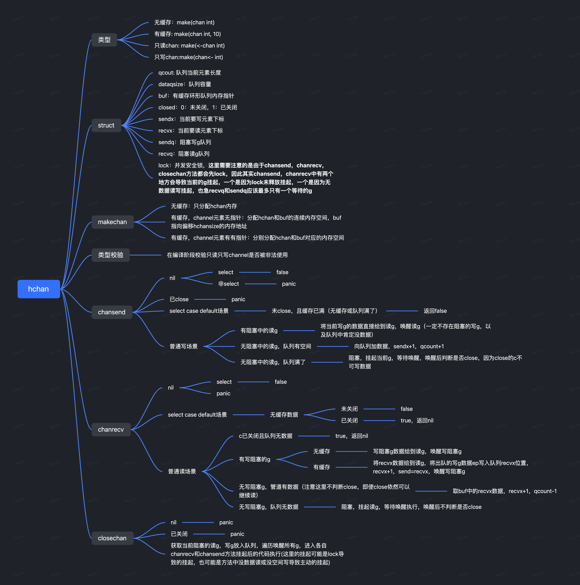

# chan源码阅读

> 不要通过共享内存来通信，而应该通过通信(消息)来共享内存  
> Communicating Sequential Processes（通信顺序进程CSP）  
> 本文基于go 1.16源码  



### 什么是channel？  
Channel是Go中的一个核心类型，你可以把它看成一个管道（消息队列），通过它并发核心单元就可以发送或者接收数据进行通讯(communication)。  
它的操作符是箭头 <-, ->, 分为  
- 只读：make(<-chan int)  
- 只写：make(chan<- int)  
- 读写：make(chan int)    
- 有缓存：make(chan int, 2) 

### channel以及相关类型的数据结构

```
type hchan struct {
        qcount   uint           // 队列中的实际使用数据量
        dataqsiz uint           // 队列的容量
        buf      unsafe.Pointer // 指向环形队列内存的指针，结合elemsize即可取得每一个数据，前提是连续地址空间
        elemsize uint16 // 队列中每个元素的大小
        closed   uint32 // 是否关闭，创建通道时该字段为0，关闭时字段为1
        elemtype *_type // channel中的元素类型
        sendx    uint   // 队列中已发送元素的索引位置，循环队列
        recvx    uint   // 队列中已接收元素的索引位置，循环队列
        recvq    waitq  // 接收阻塞中的g队列
        sendq    waitq  // 发送阻塞中的g队列
        // lock用来保护上方的所有字段，可以明确的一点，队列里任何一条数据变动，
        // 都会导致除了elemsize，elemtype，dataqsiz外都可能变，或者说除了这三个数据外
        // 改动任何数据都要上锁
        lock mutex
}
// 被阻塞等待中的g,fifo，保证先进先出
type waitq struct {
        first *sudog 
        last  *sudog
}
// 一个结构，存储了等待执行的g，
type sudog struct {
       g *g // 绑定的goroutine
        // 表示树节点的左右两个子节点
        next *sudog         // 指向右节点
        prev *sudog         // 指向左节点
        elem unsafe.Pointer // data element (may point to stack)

        // The following fields are never accessed concurrently.
        // For channels, waitlink is only accessed by g.
        // For semaphores, all fields (including the ones above)
        // are only accessed when holding a semaRoot lock.
        // 从上面可以知道一件事情，channel和semaphores是并列关系，即
        // channel不会使用semaphores，原因在于channel是有序的而semaphores是
        // 无序的，channel通过waitq来维护g？待确认
        acquiretime int64 // 对应semacquire方法，和调度策略有关？
        releasetime int64 // 对应semrelease方法
        ticket      uint32 // 和调度策略有关？

        isSelect bool // g中含有select，为什么单拎出来？

        // 表示channel通信是否成功（true：由于channel传递了信号 false：channel被closed）
        success bool

        parent   *sudog // 指向父节点
        waitlink *sudog // 被同一个elem lock的g的列表
        waittail *sudog // semaRoot？
        c        *hchan // 记录该等待中的g是由哪个channel阻塞的
}

// 信号量，通过堆栈维护阻塞总的g
// Golang: sema 
type semaRoot struct {
        lock  mutex
        // 树堆结构，树堆（Treap）是二叉排序树（Binary Sort Tree）与堆（Heap）
        // 结合产生的一种拥有堆性质的二叉排序树。堆满足在某种性质上，父节点一定比子节点大
        // 因此通过树堆结构能高效的取出最小（大）值
        treap *sudog 
        nwait uint32 // 等待的g数量，对应lock数量
}
```

### channel创建
```
func makechan(t *chantype, size int) *hchan {
        elem := t.elem

        // compiler checks this but be safe.
        if elem.size >= 1<<16 {
                throw("makechan: invalid channel element type")
        }
        if hchanSize%maxAlign != 0 || elem.align > maxAlign {
                throw("makechan: bad alignment")
        }
        // 计算需要分配管道中元素的内存大小
        mem, overflow := math.MulUintptr(elem.size, uintptr(size))
        if overflow || mem > maxAlloc-hchanSize || size < 0 {
                panic(plainError("makechan: size out of range"))
        }

        // Hchan does not contain pointers interesting for GC when elements stored in buf do not contain pointers.
        // buf points into the same allocation, elemtype is persistent.
        // SudoG's are referenced from their owning thread so they can't be collected.
        // TODO(dvyukov,rlh): Rethink when collector can move allocated objects.
        var c *hchan 
        // 使用cgo分配指向连续空间结构的指针
        switch {
        case mem == 0: // 无缓存
                // Queue or element size is zero.
                c = (*hchan)(mallocgc(hchanSize, nil, true))
                // Race detector uses this location for synchronization.
                c.buf = c.raceaddr()
        case elem.ptrdata == 0: // ptrdata表示struct中最远指针字段的偏移（包含自身），使用bitmap标识哪些字段是指针
                // 不包含指针，有缓存，结构固定，可以申请连续空间
                // Allocate hchan and buf in one call.
                c = (*hchan)(mallocgc(hchanSize+mem, nil, true))
                // buf就是偏移了hchanSize长度的管道数据存储地址
                c.buf = add(unsafe.Pointer(c), hchanSize)
        default:
                // 有指针，有缓存，为c申请内存空间，管道数据得单独分配
                // 这里没有一次分配，因为有指针的结构体内存没法确认可能变动，还是当gc的时候受到影响？
                c = new(hchan)
                // 此时buf和c的地址空间没有关系
                c.buf = mallocgc(mem, elem, true)
        }

        c.elemsize = uint16(elem.size)
        c.elemtype = elem
        c.dataqsiz = uint(size)
        lockInit(&c.lock, lockRankHchan)

        return c
}
```

### golang在哪里对只读只写channel做校验？
```
// cmd/compile/internal/gc/typecheck.go:typechekc1
if !t.IsChan() {
        yyerror("invalid operation: %v (receive from non-chan type %v)", n, t)
        n.Type = nil
        return n
}

if !t.ChanDir().CanRecv() {
        yyerror("invalid operation: %v (receive from send-only type %v)", n, t)
        n.Type = nil
        return n
}

if !t.IsChan() {
        yyerror("invalid operation: %v (send to non-chan type %v)", n, t)
        n.Type = nil
        return n
}

if !t.ChanDir().CanSend() {
        yyerror("invalid operation: %v (send to receive-only type %v)", n, t)
        n.Type = nil
        return n
}
```

### channel如何进行receive，send通信的，阻塞的时候发生了什么，唤醒的时候又做了什么？
```
// 当用户代码为c <- x，会编译成chansend1调用
func chansend1(c *hchan, elem unsafe.Pointer) {
        chansend(c, elem, true, getcallerpc())
}
// 当使用select时候，以下代码（两个case，且其中一个是default）会被
//        select {
//        case c <- v:
//                ... foo
//        default:
//                ... bar
//        }
// 编译器编译为（优化）
//        if selectnbsend(c, v) {
//                ... foo
//        } else {
//                ... bar
//        }
//
func selectnbsend(c *hchan, elem unsafe.Pointer) (selected bool) {
        // getcallerpc返回其调用方的程序计数器（PC）。用于存放下一条指令所在单元的地址的地方。
        return chansend(c, elem, false, getcallerpc())
}
func full(c *hchan) bool { // 队列是否满
        if c.dataqsiz == 0 {
                return c.recvq.first == nil
        }
        return c.qcount == c.dataqsiz
}
// 读channel，c是channel，ep：写的数据，block：表示是否需要睡眠channel所在的g，callerpc：不知道
func chansend(c *hchan, ep unsafe.Pointer, block bool, callerpc uintptr) bool {
        if c == nil { // 若hchan未初始化
                if !block {
                        return false // 注意select结合channel会随机执行一个可执行的case，不会阻塞，所以传block：false
                }
                // 挂起  
                gopark(nil, nil, waitReasonChanSendNilChan, traceEvGoStop, 2)
                throw("unreachable")
        }
        // select && 未关闭  && c 是无缓存且此时无接收者或缓存满了的状态
        if !block && c.closed == 0 && full(c) {
                return false // select case 命中失败
        }

        var t0 int64
        if blockprofilerate > 0 {
                t0 = cputicks()
        }

        lock(&c.lock)
        // 不可以写数据到已关闭的channel
        if c.closed != 0 {
                unlock(&c.lock)
                panic(plainError("send on closed channel"))
        }
        // 取出阻塞等待中的一个读channel的g，将eq直接传给该g，同时设置该g为runnable，唤醒它，这里一个隐藏逻辑是有阻塞的读g，一定不存在阻塞的写g，以及队列中肯定没数据
        if sg := c.recvq.dequeue(); sg != nil {
                send(c, sg, ep, func() { unlock(&c.lock) }, 3)
                return true
        }
        // channel还有空间，且没有阻塞的读channelg，
        if c.qcount < c.dataqsiz {
                // Space is available in the channel buffer. Enqueue the element to send.
                // 获得新入队数据的存储位置qp
                qp := chanbuf(c, c.sendx)
                // 在qp位置存入对应类型元素大小的数据ep副本
                typedmemmove(c.elemtype, qp, ep)
                c.sendx++ // 环形队列写入数据下标+1
                if c.sendx == c.dataqsiz { // 循环从0开始
                        c.sendx = 0
                }
                c.qcount++ // 管道中实际数据+1
                unlock(&c.lock)
                return true
        }
        // channel 缓存已满，且没有阻塞的读recvq g，且是select，不阻塞，select case 命中失败
        if !block {
                unlock(&c.lock)
                return false
        }

        // Block on the channel. Some receiver will complete our operation for us.
        gp := getg()
        mysg := acquireSudog()// 缓存已满，此时写channel的g需要阻塞，因此创建sudog，将g加入sendq
        mysg.releasetime = 0
        if t0 != 0 {
                mysg.releasetime = -1
        }
        // 保存待进入channel的数据和sudog
        mysg.elem = ep 
        mysg.waitlink = nil
        mysg.g = gp
        mysg.isSelect = false
        mysg.c = c
        gp.waiting = mysg
        gp.param = nil
        c.sendq.enqueue(mysg)
        // 设置goroutine为等待唤醒状态,再休眠
        atomic.Store8(&gp.parkingOnChan, 1)
        // 挂起
        gopark(chanparkcommit, unsafe.Pointer(&c.lock), waitReasonChanSend, traceEvGoBlockSend, 2)
        // 读操作唤醒写阻塞
        KeepAlive(ep)

        if mysg != gp.waiting {
                throw("G waiting list is corrupted")
        }
        gp.waiting = nil
        gp.activeStackChans = false
        closed := !mysg.success // 因为channel通信唤醒了sudog
        gp.param = nil
        if mysg.releasetime > 0 {
                blockevent(mysg.releasetime-t0, 2)
        }
        mysg.c = nil
        releaseSudog(mysg)  // 把sudog放回local p or全局调度sudogcache
        if closed {
                if c.closed == 0 { // 未关闭
                        throw("chansend: spurious wakeup")
                }
                panic(plainError("send on closed channel"))
        }
        return true // 写成功
}
func send(c *hchan, sg *sudog, ep unsafe.Pointer, unlockf func(), skip int) {
        if raceenabled {
                if c.dataqsiz == 0 {
                        racesync(c, sg)
                } else {
                        // Pretend we go through the buffer, even though
                        // we copy directly. Note that we need to increment
                        // the head/tail locations only when raceenabled.
                        racenotify(c, c.recvx, nil)
                        racenotify(c, c.recvx, sg)
                        c.recvx++
                        if c.recvx == c.dataqsiz {
                                c.recvx = 0
                        }
                        c.sendx = c.recvx // c.sendx = (c.sendx+1) % c.dataqsiz
                }
        }
        if sg.elem != nil {
                // 接受者未接收到数据，将写的ep直接给到接收者
                sendDirect(c.elemtype, sg, ep)
                sg.elem = nil // 不懂为什么情况
        }
        gp := sg.g
        unlockf()
        gp.param = unsafe.Pointer(sg)
        sg.success = true
        if sg.releasetime != 0 {
                sg.releasetime = cputicks()
        }
        // 唤醒阻塞中的读g
        goready(gp, skip+1)
}
// 编译器编译
//        select {
//        case v = <-c:
//                ... foo
//        default:
//                ... bar
//        }
// 为
//        if selectnbrecv(&v, c) {
//                ... foo
//        } else {
//                ... bar
//        }
func selectnbrecv(elem unsafe.Pointer, c *hchan) (selected bool) {
        selected, _ = chanrecv(c, elem, false)
        return
}
// 编译器编译
//        select {
//        case v, ok = <-c:
//                ... foo
//        default:
//                ... bar
//        }
// 为
//        if c != nil && selectnbrecv2(&v, &ok, c) {
//                ... foo
//        } else {
//                ... bar
//        }
func selectnbrecv2(elem unsafe.Pointer, received *bool, c *hchan) (selected bool) {
        selected, *received = chanrecv(c, elem, false)
        return
}
// entry points for <- c from compiled code
func chanrecv1(c *hchan, elem unsafe.Pointer) {
        chanrecv(c, elem, true)
}
// selected用于case的成功失败，received：用于读取的成功失败
// recv中的eq是用于赋值的，即eq := <-c
func chanrecv(c *hchan, ep unsafe.Pointer, block bool) (selected, received bool) {
       if c == nil { // 从空channel读数据
                if !block { // 不阻塞
                        return
                }
                // 跑抛错
                gopark(nil, nil, waitReasonChanReceiveNilChan, traceEvGoStop, 2)
                throw("unreachable")
        }

        if !block && empty(c) { // select， 且c无缓存，且无写数据
                if atomic.Load(&c.closed) == 0 { // 未关闭，返回：false， false
                        return 
                }
                if empty(c) { // 无缓存，无数据
                        if ep != nil { // 将 ep 指向的类型为 elemtype 的内存块置为 0 值
                                typedmemclr(c.elemtype, ep)
                        }
                        return true, false
                }
        }

        var t0 int64
        if blockprofilerate > 0 {
                t0 = cputicks()
        }

        lock(&c.lock)

        if c.closed != 0 && c.qcount == 0 { // channel已关闭且队列无数据，再读取就是空值
                unlock(&c.lock)
                if ep != nil {// 将 ep 指向的类型为 elemtype 的内存块置为 0 值
                        typedmemclr(c.elemtype, ep)
                }
                return true, false
        }
        // 有写阻塞等待的g，1. 如果是无缓存管道，直接从sendg.elem给到receive
        // 2. 否则先从recvq队列头取数据执行，且将sg加入recvq尾部排队执行
        // 由recv唤醒写阻塞等待的g，再在116行判断close状态
        if sg := c.sendq.dequeue(); sg != nil {
                recv(c, sg, ep, func() { unlock(&c.lock) }, 3)
                return true, true
        }
        // 注意这里没有判断close，由于close方法和chanrecv通过lock保证原子性，所以当close后
        // 且管道中还有数据，就会走一下逻辑不阻塞直接返回结果
        if c.qcount > 0 { // 队列有数据，且无待执行的sendq g，则读出数据
                // Receive directly from queue
                qp := chanbuf(c, c.recvx)
                if ep != nil {
                        typedmemmove(c.elemtype, ep, qp)
                }
                typedmemclr(c.elemtype, qp)
                c.recvx++ // 读的下标+1
                if c.recvx == c.dataqsiz { // 循环从0开始
                        c.recvx = 0
                }
                c.qcount-- // 数量-1
                unlock(&c.lock)
                return true, true
        }
        // channel没有数据，且无待执行的sendq g，且是select，返回false
        if !block {
                unlock(&c.lock)
                return false, false
        }

        // channel没有数据，且无待执行的sendq g，且不是select，读阻塞
        gp := getg()
        mysg := acquireSudog()
        mysg.releasetime = 0
        if t0 != 0 {
                mysg.releasetime = -1
        }
        // No stack splits between assigning elem and enqueuing mysg
        // on gp.waiting where copystack can find it.
        mysg.elem = ep
        mysg.waitlink = nil
        gp.waiting = mysg
        mysg.g = gp
        mysg.isSelect = false
        mysg.c = c
        gp.param = nil
        c.recvq.enqueue(mysg) // 读阻塞，进入队列
        // Signal to anyone trying to shrink our stack that we're about
        // to park on a channel. The window between when this G's status
        // changes and when we set gp.activeStackChans is not safe for
        // stack shrinking.
        atomic.Store8(&gp.parkingOnChan, 1)
        // 注意这里，由于前面已经做了lock，导致后续的都会在lock()阻塞
        // 挂起
        gopark(chanparkcommit, unsafe.Pointer(&c.lock), waitReasonChanReceive, traceEvGoBlockRecv, 2)

        // 唤醒，写会唤醒
        if mysg != gp.waiting {
                throw("G waiting list is corrupted")
        }
        gp.waiting = nil
        gp.activeStackChans = false
        if mysg.releasetime > 0 {
                blockevent(mysg.releasetime-t0, 2)
        }
        success := mysg.success
        gp.param = nil
        mysg.c = nil
        releaseSudog(mysg) // 把sudog放回local p or全局调度sudogcache
        return true, success
}
func recv(c *hchan, sg *sudog, ep unsafe.Pointer, unlockf func(), skip int) {
        if c.dataqsiz == 0 { // 无缓存
                if raceenabled {
                        racesync(c, sg)
                }
                if ep != nil { // 
                        // copy data from sender
                        recvDirect(c.elemtype, sg, ep)
                }
        } else {
                // Queue is full. Take the item at the
                // head of the queue. Make the sender enqueue
                // its item at the tail of the queue. Since the
                // queue is full, those are both the same slot.
                qp := chanbuf(c, c.recvx)
                if raceenabled {
                        racenotify(c, c.recvx, nil)
                        racenotify(c, c.recvx, sg)
                }
                // copy data from queue to receiver
                if ep != nil { // 取队列recvx的头，取完之后由于recvx+1且是环形队列，就变成尾部了
                        typedmemmove(c.elemtype, ep, qp)
                }
                // copy data from sender to queue 注意此时队列是满的
                typedmemmove(c.elemtype, qp, sg.elem)
                c.recvx++
                if c.recvx == c.dataqsiz {
                        c.recvx = 0
                }
                c.sendx = c.recvx // c.sendx = (c.sendx+1) % c.dataqsiz
        }
        sg.elem = nil
        gp := sg.g
        unlockf()
        gp.param = unsafe.Pointer(sg)
        sg.success = true
        if sg.releasetime != 0 {
                sg.releasetime = cputicks()
        }
        // 注意这里的gp是写阻塞g，读g是无中断执行的
        goready(gp, skip+1)
}
```
### channel在close做了什么事情？
```
func closechan(c *hchan) {
        if c == nil { // 关闭nil channel panic
                panic(plainError("close of nil channel"))
        }

        lock(&c.lock) // 这里很重要，保证了close和send和recv不冲突
        if c.closed != 0 { // 已经close，释放锁，再panic
                unlock(&c.lock)
                panic(plainError("close of closed channel"))
        }

        c.closed = 1 // close

        var glist gList // 取出剩下待读待写的g进入glist

        for {
                sg := c.recvq.dequeue() // sudog
                if sg == nil {
                        break
                }
                if sg.elem != nil {// 将 sg.elem 指向的类型为 elemtype 的内存块置为 0 值
                        typedmemclr(c.elemtype, sg.elem)
                        sg.elem = nil
                }
                if sg.releasetime != 0 {
                        sg.releasetime = cputicks()
                }
                gp := sg.g
                gp.param = unsafe.Pointer(sg)
                // 这里设置false后，对应chanrecv的gopark恢复后续流程执行，未限制close，
                // 所以channel close后可正常读
                sg.success = false 
                if raceenabled {
                        raceacquireg(gp, c.raceaddr())
                }
                glist.push(gp)
        }

        // 取出待写的g进入glist
        for {
                sg := c.sendq.dequeue()
                if sg == nil {
                        break
                }
                sg.elem = nil
                if sg.releasetime != 0 {
                        sg.releasetime = cputicks()
                }
                gp := sg.g
                gp.param = unsafe.Pointer(sg)
                sg.success = false // 这里很重要,结合chansend的109行和120行可知，不能向已关闭的chan写数据
                if raceenabled {
                        raceacquireg(gp, c.raceaddr())
                }
                glist.push(gp)
        }
        unlock(&c.lock)

        // 循环将glist放入P的local queue，等待调度。
        for !glist.empty() {
                gp := glist.pop()
                gp.schedlink = 0
                goready(gp, 3)
        }
}
```
### 问题：
1. channel如何做到并发安全的?  
答：通过lock保证并发时qcount，buf，sendx，recvx，sendq，recvq,closed数据的安全读写，从而实现channel读写的并发安全
2. channel如何保证有序？  
答：通过lock和buf环形队列一起保证有序


参考：  
[详尽干货！从源码角度看 Golang 的调度（上）](https://www.infoq.cn/article/r6wzs7bvq2er9kuelbqb)  
[详尽干货！从源码角度看 Golang 的调度（下）](https://www.infoq.cn/article/nuvrpz1cpk9cw0hp3bky)  
[深入golang runtime的调度](https://zboya.github.io/post/go_scheduler/)   
[Linux Lock 与 Golang Mutex 的实现与性能分析](https://blog.xiaokezhao.com/locks-golang-mutex-implementation-performance-measure/)  
[Golang Sync](https://xujianhai.fun/posts/golang-sync/)  
[OLANG漫谈](https://ustack.io/2019-10-04-Golang%E6%BC%AB%E8%B0%88%E4%B9%8Bchannel%E5%A6%99%E6%B3%95.html)  
[golang的Mutex锁如何实现](http://blog.newbmiao.com/2019/10/10/go_mutex_insight.html)   
[深度剖析 Golang 的 GC 扫描对象的实现](https://jishuin.proginn.com/p/763bfbd298dc)