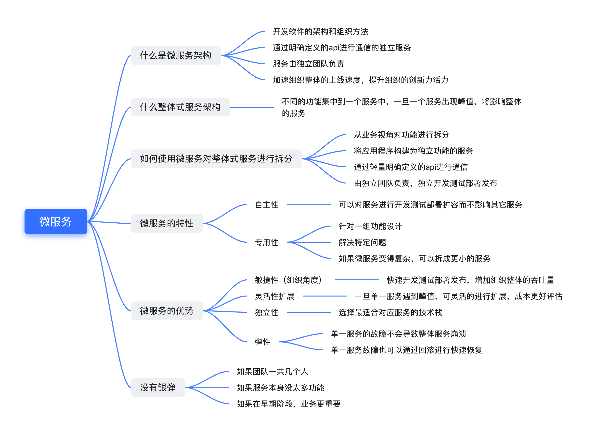

# 微服务

## 什么是微服务？
微服务是一种开发软件的架构和组织方法，其中软件由通过明确定义的 API 进行通信的小型独立服务组成。这些服务由各个小型独立团队负责。
微服务架构使应用程序更易于扩展和更快地开发测试，更快独立部署，灰度发布，从而加速创新并缩短新功能的上市时间。
## 什么是整体式架构？
整体式架构，所有服务进程紧密耦合，并作为单项服务运行。但是如果服务中一个进程遇到峰值，则需要整体扩展架构，相较于微服务中单服务扩展显然更复杂。
随着代码库的增长，添加或改进整体式应用程序会变得更加复杂，更加难以测试。而这种复杂性必然增加整个服务出错的风险，限制了业务的快速试错。
## 如何使用微服务来对整体式服务进行拆分？
从业务视角来对功能进行划分，将应用程序构建为独立功能服务，这些服务使用轻量级API通过明确定义的接口进行通信，每项服务执行一项功能。
由于它们是独立运行的，因此可以针对各项服务进行更新、部署、扩展，以满足对应用程序特定功能的需求。
## 微服务的特性
### 自主性
可以对微服务架构中的每个组件服务进行开发、部署、运营和扩展，而不影响其他服务的功能。这些服务不需要与其他服务共享代码或实施。
各个组件之间的通信都是通过明确定义的API进行的。
### 专用性
每项服务都是针对一组功能而设计的，并专注于解决特定的问题。如果开发人员逐渐将更多代码增加到一项服务中并且使得这项服务变得复杂，那么可以将其
拆分到更小的服务。
## 微服务的优势
### 敏捷性（组织角度）
微服务促进若干小型独立团队形成一个组织，这些团队负责自己的服务。各团队在小型且易于理解的环境中行事，并且可以更独立、更快速地工作。这缩短了开发周期。您可以从组织的总吞吐量中显著获益。
### 灵活扩展（技术角度）
通过微服务，您可以独立扩展各项服务以满足其支持的应用程序功能的需求，比如扩展配置。这使团队能够适当调整基础设施需求，以准确衡量功能成本，并在服务需求激增时保持可用性。
### 轻松部署（技术角度）
微服务支持持续集成和持续交付，可以轻松尝试新想法,并且可以在无法正常运行时回滚。由于故障成本较低，因此可以大胆试验，更轻松地更新代码，并缩短新功能的上市时间。
### 技术自由
微服务架构不遵循”一刀切“的方法。团队可以自由选择最佳工具来解决实际问题。因此构建微服务的团队可以为每项服务选择最佳工具
### 弹性
服务独立性增加了应用程序应对故障的弹性。在整体式架构中，如果一个组件出现故障，可能会导致整个应用程序无法运行。通过微服务，应用程序可以通过降级或扩容而不导致整个应用程序崩溃来处理总体服务的故障。

