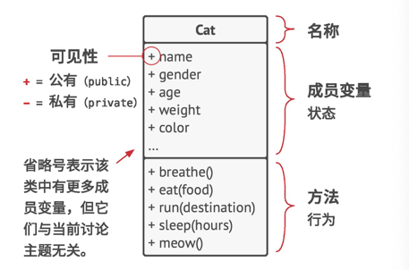
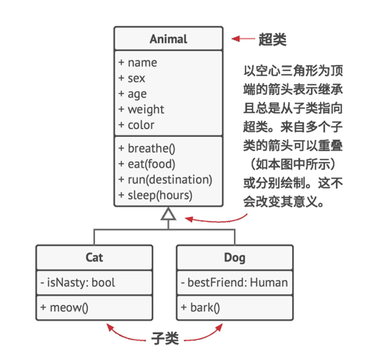
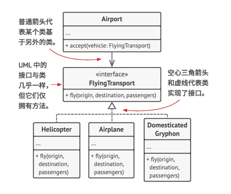
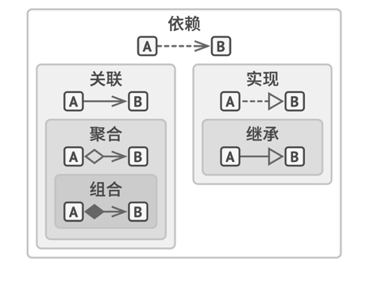

## 如何阅读
1. 每章讨论一个特定的模式，按照顺序读即可。
2. 模式之间存在着互相练习，每章末尾会列出与当前模式相关的其它模式的链接。
3. 本书也会介绍许多UML图，可以顺带学习哦。

## 面向对象程序设计简介
### uml图

## 面向对象程序设计基础
Object-Oriented Programming 即OOP

是一种编程范式，基本理念是将数据块和数据相关的行为封装成为特殊的、名为对象的实体，同时对象实体的生成工作则是基于程序员给出的一系列”蓝图“，这些”蓝图“就是类。

### 对象和类
类由成员变量和方法组成。
存储在对象成员变量中的数据通常被称为状态，对象中的所有方法则定义了其行为。
对象是类的实例。
比如小花的毛色是黑白相间，小灰的毛色是灰色的，眼神被称为构的毛色，毛色是狗的变量，即毛色状态，如果你哪天给小灰做个洗剪吹，顺带染个色，那毛色就会变化。
这里小花和小灰就是构这个类的对象。

### 类层次结构
上文我们认为狗是一个类，但狗同时也属于动物。
显然一个复杂程序不会仅包含一个类。一些类可能会组织起来形成类层次结构。
如超类和子类

多个子类的抽象可以成为超类（父类）。
子类继承父类的状态和行为，但子类会增加不同于父类的属性和方法。
子类可以对从父类继承而来的方法的行为进行重写。子类可以完全替换默认行为，也可以仅提供额外内容来对齐进行加强。

### 面向对象程序设计的四个基本概念使其区别于其他程序设计范式
#### 抽象
抽象是一种反应真实世界对象或现象中特定内容的模型，它能高精度的反应所有与特定内容相关的详细信息，同时忽略其他内容。
#### 封装
将复杂性隐藏在简单的接口里面，并对外暴露，例如你通过启动汽车的开关，使用方向盘结合踏板就能控制一台车行驶。同时你无法触碰到隐藏在汽车内部的电控系统，动力系统。
封装指一个对象对其他对象隐藏其部分状态和行为，而仅向程序其他部分暴露有限的接口的能力。
封装一位着使用关键字private来修饰，这样仅有其所在类中的方法才能访问这些内容。
或者使用限制程度较小的关键字protected保护，对象仅允许父类访问其类中的成员。
在go中使用interface来定义对象之间的交互协议。

#### 继承
继承是指在根据已有类创建新类的能力。
继承最主要的好处是代码复用。如果你想要创建的类与已有的类差异不大，那就扩展已有类，并将额外功能放入生成的子类。
使用继承后，子类将拥有与其父类相同的接口。
如果父类中声明了某个方法，那么你将无法在子类中隐藏该方法。你还必须实现所有的抽象方法。
大部分的编程语言中，子类仅能对一个父类进行扩展。另一个方面，任何类都能同时实现多个接口。如果父类实现了某个接口，那么其所有的子类都必须实现该接口。
#### 多态
多态是指程序能够检测对象所属的实际类，并在当前上下文不知道其真实类型的情况下调用其实现的能力。

## 对象之间的关系
对象之间的关系除了继承和实现之外，还包括依赖，关联。    

**依赖**  
是类之间最基础的，也是最微弱的关系。如果修改一个类的定义可能会造成另一个类的变化，那么这两个类之间就存在依赖关系。  
可以通过让代码依赖接口或抽象类（而非具体类），可以降低对象之间的依赖程度。  
通常情况下，UML图不会展示所有依赖，毕竟在真实代码中的数量太多了。为了不让依赖关系破坏UML图，你必须进行精心选择，仅展示哪些对于沟通你的想法来说重要的依赖关系。  

上图是uml图中表示的简单依赖关系。  
   
**关联**  
是一个对象使用另一个对象或与另一个对象进行交互的关系。  
在UML图中，关联关系用起始与一个对象并指向其所使用的对象的简单箭头来表示，也可以用双向箭头来表示双向关联。  
关联可视为一种特殊类型的依赖，即一个对象总是拥有访问与其交互对象的权限，而简单的依赖关系并不会在对象间建立永久性的练习。  
比如你总能通过订单来获取顾客。那么订单和用户就是关联关系。  
  
**聚合**  
是一种特殊类型的关联，用于表示多个对象之间的”一对多“，”多对多“或”整体对部分“的关系。  
普通关联仅用于描述两个对象之间的关系。通常在聚合关系中，一个对象”拥有“一组其他对象，并扮演着容器或集合的角色。组件可以独立于容器存在，也可以同时连接多个容器。  
在UML图中，聚合关系使用一端是空心菱形，另一端指向组件的箭头来表示。也可以使用UML符号在关系两端标明数量。  
  

**组合**  
是一种特殊类型的聚合，其中一个对象由一个或多个其他对象实例构成。组合与其他关系的区别在于组件能作为容器的一部分存在。在UML图中，组合于聚合关系的符号相同，但箭头起始处的菱形是实心的。
注意，许多人常常在实际想说聚合和组合时使用”组合“这个术语。其中最恶名昭彰的例子是著名的”组合优于继承“原则。这并不是因为人们不清楚它们之间的差别，而是因为”组合“例如对象组合说起来更顺口。（ps：~~好像优点道理）。  

**总结**  
上面说了类除了继承和实现一位的其它关系：依赖、关联、聚合、组合。  
那么它们之间有什么关系，区别是什么呢？  
 
结合图片，对象和类之间的关系：从弱到强  
**依赖**: 对类B进行修改会影响到类A。  
**关联**：对象A知道对象B。类A依赖于类B。  
**聚合**: 对象A知道对象B且由B构成。类A依赖于类B。  
**组合**: 对象A知道对象B、由B构成而且管理着B的生命周期。类A依赖于类B。   
**实现**: 类A定义的方法由接口B声明。对象A可被视为对象B。类A依赖于类B。  
**继承**: 类A继承类B的接口和实现，但是可以对其进行扩展和覆盖。对象A可被视为对象B。类A依赖于类B。  

## 设计模式简介
### 什么是设计模式？
设计模式是软件设计中常见问题的典型解决方案。它们就像能根据需求进行调整的预制蓝图，可用于解决代码中反复出现的设计问题。  
设计模式与方法或库的使用方法不同，你很难直接在自己的程序中套用某个设计模式。模式并不是一段特定的代码，而是解决特定问题的一般性概念。你可以根据模式来实现符合自己程序实际所需的解决方案。 
人们常常会混淆模式和算法，因为两者在概念上都是已知特定问题的典型解决方案。但算法总是明确定义达成特定目标所需的一系列步骤，而模式则是对解决方案的更高层次描述。  
同一模式在两个不同程序中的实现代码可能会不一样。  
算法更像是菜谱：提供达成目标的明确步骤。  
而模式更像是蓝图：你可以看到最终的结果和模式的功能，但需要自己确定实现步骤。  
### 设计模式包含哪些内容？
大部分模式的描述都会遵循特定的形式，以便在不同情况下使用。模式的描述通常会包括以下部分：  
* 意图部分简要地描述问题和解决方案。  
* 动机部分进一步解释问题并说明模式会如何提供解决方案。  
* 结构部分展示模式的各个部分和它们之间的关系。  

在不同语言中的实现提供流行编程语言的代码，让读者更好的理解模式背后的思想。  
部分模式介绍中还列出了其他的一些使用细节，例如模式的适用性、实现步骤以及其他模式的关系。  
### 模式的分类
不同设计模式在其复杂程度、细节层次以及在整个系统中的应用范围等方面各不相同。我喜欢将其比作道路的建造：如果你希望让十字路口更加安全，那么可以状一些交通信号灯，或者修建有行人地下通道的多层互通式立交桥。  
最基础的、底层的模式通常被称为惯用技巧。这类模式一般只能在一种编程语言中使用（不具有通用性，和语言高耦合）。  
最通用的、高层的模式是架构模式。开发者可以再任何编程语言中使用这类模式。与其他模式不同，它们可用于整个应用程序的架构设计。  
此外，所有模式可以更加意图或目的来分类。   
本书覆盖了三种主要的模式类别：  
* 创建型模式提供创建对象的机制，增加已有代码的灵活性和可复用性。
* 结构型模式介绍如何将对象和类组装成较大的结果，并同时保持结果的灵活和高效。  
* 行为模式负责对象间的高效沟通和职责委派。

### 谁发明了设计模式？
设计模式并不是发明的，而是人们基于大量实践后的总结归纳。  
### 为什么以及如何学习设计模式？
* 设计模式能指导你如何使用面向对象的设计原则来解决各种问题。  
因为设计模式是针对软件设计中常见问题的工具箱，其中的工具就是各种经过实践验证的解决方案。  
* 设计模式定义了一种让你和团队成员能够更加高效沟通的通用语言。你只需说”哦，这里用单例就可以了“，所有人都会理解这条建议背后的想法。只要知晓模式及其名称，你就无需解释什么是单例。

## 软件设计原则
### 优秀设计特征
#### 代码复用
无论是开发何种软件产品，成本和时间都是最重要的两个维度。  
较短的开发时间意味着可比竞争对手更早进入时长；较低的开发成本一位着能够流出更多的营销资金，因此能更广泛地覆盖潜在客户。  
代码复用是减少开发成本时最常用的方式之一。其意图非常明显：与其反复从头开发，不如在新对象中重用已有代码。  
这个想法表面看起来很棒，但实际上要让已有代码在全新的上下文中工作，通常开始需要付出额外努力的。组件间紧密的耦合、对具体类而非接口的 依赖和硬编码的行为都会降低代码的灵活性，使得复用这些代码变得更加困难。  
使用设计模式是增加软件组件灵活性并使其易于复用的方式之一。但有时这也会让组件变得更加复杂。  
但模式还是能让你能独立于具体代码来复用设计思想和理念，这样的方式比框架的风险小，比复用类库、容器的复用性更高。  
#### 扩展性
变化是程序员生命中唯一不变的事情。  
毕竟事物是在不断变化的，而你对事物的理解也是不断变化提升的。最终为了作出更好的产品，服务就必须不断的变化。
### 设计原则
如何让你的架构灵活稳定且易于理解？  
这是系统设计需要思考的问题。  
#### 封装变化的内容
找到程序中的变化内容并将其与不变的内容区分开。这样能将变更造成的影响最小化。
##### 方法层面的封装
##### 类层面的封装
##### 面向接口开发，而不是面向实现

